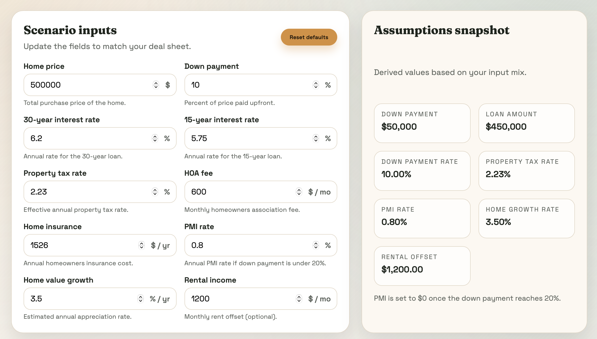
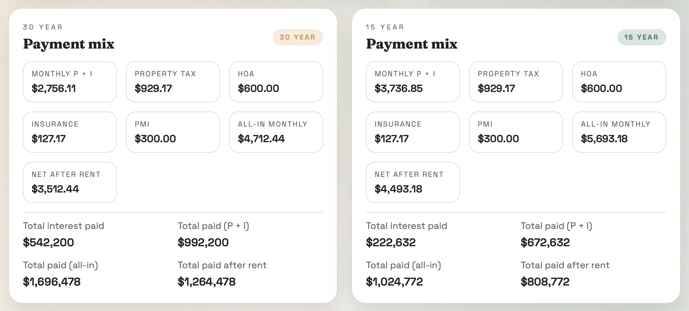
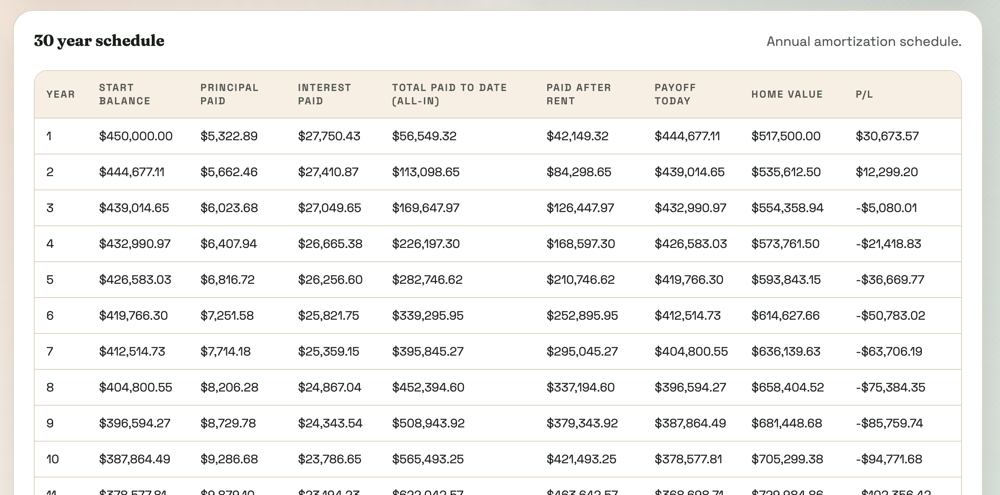

# Mortgage Atlas

Mortgage Atlas is a React + Vite web app that turns mortgage math into an
interactive, visual planner. Tune prices, rates, taxes, fees, and rental
offsets to compare 30-year vs 15-year terms, then explore year-by-year
amortization with payoff and home value projections.

## Features
- Editable inputs for rates, fees, and rental offset
- 30-year and 15-year summaries with all-in and net totals
- Annual amortization tables with payoff and home value projections
- Optional home value growth rate input

## Screenshots







## Getting started

```bash
npm install
npm run dev
```

Then open http://localhost:5174 (or the port Vite prints in your terminal).

## Build and preview

```bash
npm run build
npm run preview
```

## Notes
- Rates are entered as percentages (example: 6.2 for 6.2%).
- PMI is set to 0 once the down payment reaches 20%.
- The original CLI script is still available in `main.py`.
